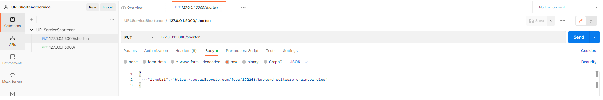
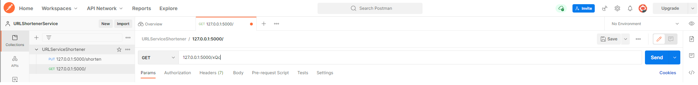

# URLShortenerService

URLShortenerService is a ASP.NET Core WebApplication with a REST API for shortening URLs.

URLShortenerService uses Docker to build and run the API Service, and links to the official MySQL container image for persistence. 

## Dependencies
* [.NET 6 SDK / ASP.NET Runtime](https://dotnet.microsoft.com/en-us/download/dotnet/6.0)
* [Visual Studio 2022](https://visualstudio.microsoft.com/vs/)
* [Docker](https://docs.docker.com/get-docker/) - MAKE SURE YOU ARE USING DOCKER-COMPOSE V2.X.X 
* Windows/Linux

## Quick Caveats
- An SQL script runs against the MySQL DB adding 10000 randomly generated URL entries. Please wait for this script to finish when performing the *docker-compose up* before running and API Requests


## Building Locally

You can build the project locally and open *URLShortenerService.sln* in VS2022 to view the source and debug API Service inside of Docker Container.
However it is much more convenient to use the docker-compose script below.
```
$ cd ./URLShortenerService
$ dotnet build
```
## Run Service for Testing

Build/Run containers using Docker Compose
```
$ cd ./URLShortenerService
$ docker-compose -f .\docker-compose.yml up
```

### API
#### PUT Shorten URL
```
127.0.0.1:5000/shorten
{
    "longUrl": "https://ea.gr8people.com/jobs/172266/backend-software-engineer-dice"
}
```
200 OK - Response: Shortened URL Code 
```
xQc
```
409 Conflict - Response: Notification that URL has already been shortened, with corresponding code 
```
Url already shortened: xQc
```

#### GET Long URL
```
127.0.0.1:5000/{code}
```
200 OK - Response: Original Long URL
```
https://ea.gr8people.com/jobs/123456
```
404 NotFound - Response: 
```
ID Not found in URL DB
```

## Testing 
### Automated Testing
Included is a suite of unit and integration tests.
#### Unit Tests for Encoding/Decoding algorithm
TestEncodeDecodeOfIdInteger - Tests encode/decode algorithm
TestEncodeDecodeFor1000000Operations - Tests encode/decode algorithm 1mil times

```
$ cd ./URLShortenerService
dotnet test --logger "console;verbosity=detailed" --filter TestCategory="Unit"
```

#### Integration Tests against Live Service
These are active integration tests that require the system to be running.

ValidateNewIdCreation - Creates new URL against active DB
TestNewIdCreation500 - Creates 500 new URLs against active DB

```
$ cd ./URLShortenerService
$ docker-compose -f .\docker-compose.yml up
$ dotnet test --logger "console;verbosity=detailed" --filter TestCategory="Integration"
```

### Manual Testing
For convenience, use the supplied [Postman workspace](URLServiceShortener.postman_collection.json) in the repo for testing the API.

Import the workspace into Postman, test with the included HTTP Requests.





## Scalability
With Docker as the backbone of the build and runtime, it is possible to spin up additional API Containers and deploy them to a cluster of machines for high availability and redundancy,

